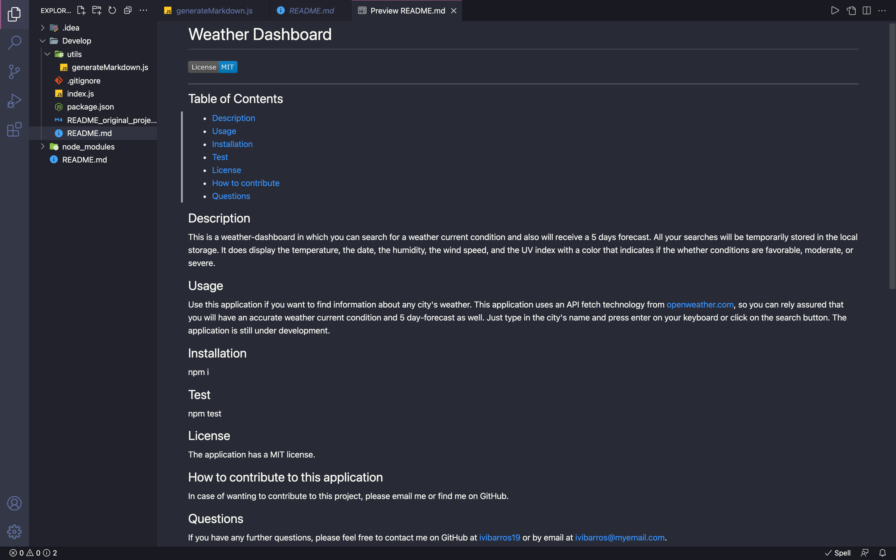
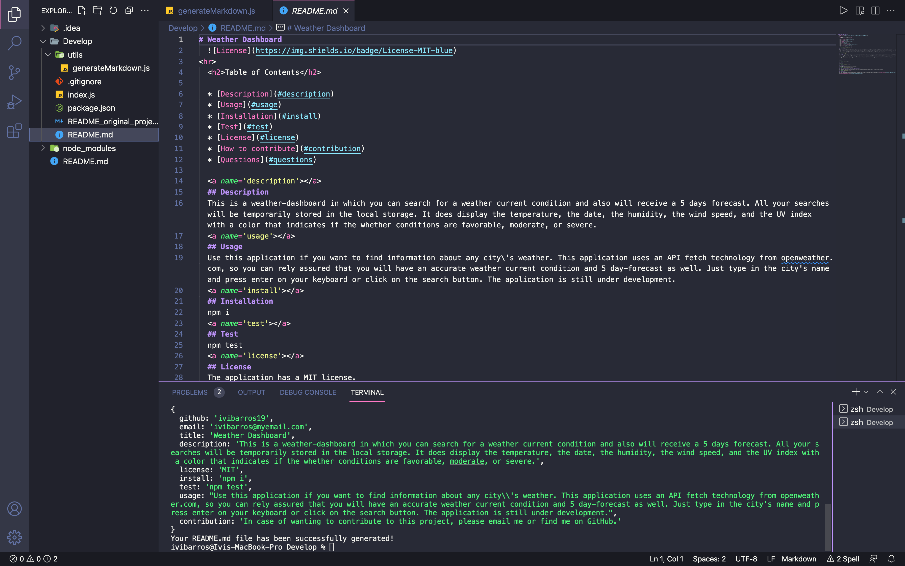

# Read me creator
  

  <h2>Table of Contents</h2>
  
  * [Description](#description)
  * [Usage](#usage)
  * [Installation](#install)
  * [Test](#test)
  * [License](#license)
  * [How to contribute](#contribution)
  * [Questions](#questions)
  
  
  ## Description
  This application helps with the creation of readme.md files. With it the user can easily create dinamically a professional README.md file.
  Technologies used: Javascript and Node.js
  
  ## Usage
  to start make sure you have node.js installed in your machine and after running the command line "node index.js" just answer the questions in your terminal to create your README.md file.
  
  ## Installation
  npm i
  
  ## Test
  npm test
  
  ## License
  The application has a MIT license.
  
  ## How to contribute to this application
  To contribute, please email me.
  
  ## Questions
  If you have any further questions, please feel free to contact me on GitHub at [ivibarros19](https://github.com/ivibarros19) or by email at [ivi@myemail.com](ivi@myemail.com).

Link to the video demonstration:
https://youtu.be/i6MZfki3VdY

Screenshots:
 
 

